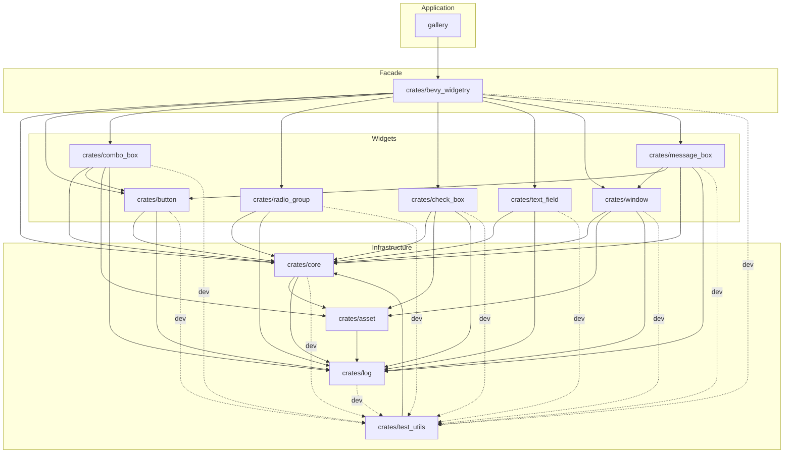

# Bevy Widgetry Architecture

本文件描述 bevy_widgetry 当前的整体 architecture、Workspace 组成以及内部依赖关系。

## Architecture Overview

bevy_widgetry 使用 Cargo Workspace 组织。

整体上由应用、顶层 facade、各功能 crate、共享基础设施和测试基础设施组成。

当前 Workspace 的主要结构为：

```text
gallery/
├── src/logging.rs
├── src/assets.rs
├── src/assets/
├── src/gallery.rs
├── src/renderer.rs
├── src/pages.rs
└── src/pages/

crates/
├── log/
├── asset/
├── bevy_widgetry/
├── core/
├── button/
├── combo_box/
├── radio_group/
├── check_box/
├── text_field/
├── window/
├── message_box/
└── test_utils/
```

## Workspace Roles

本节仅简要介绍各成员的职责和用途，不展开 API、文件分工或具体实现细节。

### `crates/bevy_widgetry`

顶层 facade crate。

负责聚合并统一暴露 Widgetry 各功能 crate，本身不承载具体 Widget 实现。

### `crates/core`

共享基础设施 crate。

承载跨 Widget 共享能力和整个 Widgetry 使用的基础设施，包括 App 级默认字体 fallback；通过 asset 加载内建得意黑。

共享 WidgetryFocusPlugin 在主 pointer 对非 EditableText 目标 press 时清空输入 focus，文本间 focus 切换交由 Bevy 官方输入 plugin 处理。

### `crates/asset`

Widgetry 内建 asset 基础设施，集中存储静态文件、embedded 注册并提供语义 asset 标识。

依赖外部 bevy 和底层 log，不依赖 core；不解析 SVG，也不由顶层 facade 直接依赖或导出。

### `crates/log`

底层内部日志基础设施，提供固定 bevy_widgetry target 的 info/warn/error macro。
生产依赖仅依赖 Bevy，测试通过 dev-dependency 使用 test_utils。
不配置 subscriber 或输出，不保存 state，不由 facade 导出。

### `crates/test_utils`

共享测试基础设施。

供各 crate 的测试复用，不属于正常生产依赖路径。

通过内部依赖 core 复用 theme type，提供统一的测试 theme 切换 helper function，并提供 thread-local 日志捕获以复用诊断行为验证。

### `gallery`

Widgetry 的实际消费者和集成展示应用，用于人工体验、集成验证和展示当前 Widget 能力。

应用日志由 logging module 配置 Bevy LogPlugin，使用固定启动本机时区，同时输出终端和 `gallery/logs/` 下每次启动新建的文件；WorkerGuard 由 main 持有到运行结束。

应用自有 asset 由内部 assets module 的 GalleryAssetPlugin 管理，与库内 asset 保持独立。

### `crates/window`

自定义 Window Widget crate，提供 window UI、theme、native window 交互与 UI lifecycle 管理。

同时提供外部资源绑定、owned window 资源的 ownership 和 parent window 的 pointer modal overlay；不承载 WidgetryMessageBox 业务语义。

### `crates/combo_box`

通过 BSN SceneComponent 组合不可编辑的 ComboBox，option 由可重复调用的 SceneList factory 提供。

Field 复用 button Widget，箭头使用 core 的 WidgetryIcon 和 asset 内建 chevron；Popup 保留 Bevy ListBox / ListItem 行为。
root 管理 selection 与 disabled 语义，Field 从真实 Selected 重建内容；不为调用方 option 自动配置字体。

### `crates/check_box`

基于 Bevy 官方 Checkbox 提供 styled binary Checkbox，并提供 Widgetry 自己的 tri-state Checkbox；两者共享 indicator、theme style 与内建 SVG asset，并保持对应 Checkbox Accessibility 语义。

### `crates/message_box`

基于 window 与 button 组合固定尺寸的 non-blocking parent-window modal dialog，提供固定结果 button 组与异步 EntityEvent。
使用 core 共享 theme foreground color，结果 observer 执行后由独立关闭阶段销毁 owned root。

### `crates/radio_group`

通过 BSN SceneComponent 提供标准 RadioGroup 与 RadioOption，用户内容追加在内建圆形 indicator 后。

复用 Bevy RadioGroup、RadioButton 与 radio_self_update 处理用户选择，以固定 direct child index 对外通知；负责默认选择、静默程序化选择、root disabled 同步及 theme style。
生产依赖仅为 Bevy、core 与 log，不依赖其他 Widget 或 asset；测试通过 dev-dependency 使用 test_utils。

### `crates/text_field`

以 Bevy 官方 EditableText 为编辑基础，通过 WidgetryTextField BSN SceneComponent 提供单 entity layout 与 theme style。

plugin 自动装配 theme 与共享 pointer focus 策略，并在官方编辑阶段前清理 disabled Widget 的用户编辑；不安装字体 fallback 或官方文本输入 plugin，文本、换行及可见行数由调用方配置。

## Dependency Graph

图中的箭头表示：

```text
A --> B
= A depends on B
```

实线表示正常生产依赖，虚线表示测试依赖。


