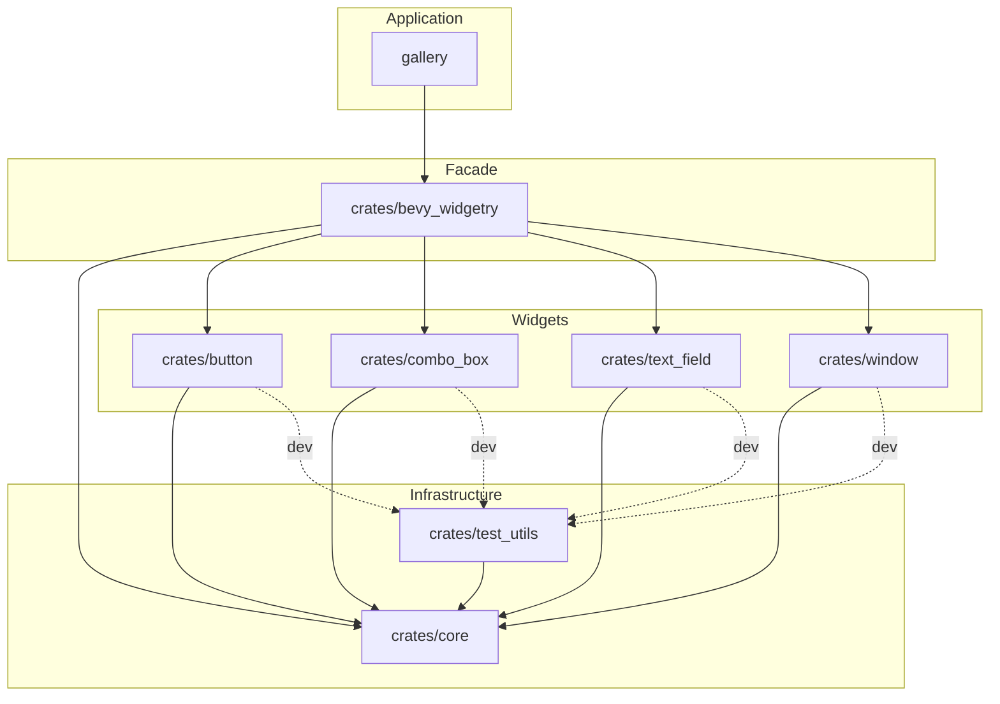

# Bevy Widgetry Architecture

本文件描述 `bevy_widgetry` 当前的整体架构、Workspace 组成以及内部依赖关系。

## Architecture Overview

`bevy_widgetry` 使用 Cargo Workspace 组织。

整体上由应用、顶层 facade、各功能 crate、共享基础设施和测试基础设施组成。

当前 Workspace 的主要结构为：

```text
gallery/
├── src/gallery.rs
├── src/renderer.rs
├── src/pages.rs
└── src/pages/

crates/
├── bevy_widgetry/
├── core/
├── button/
├── combo_box/
├── text_field/
├── window/
└── test_utils/
```

## Workspace Roles

本节仅简要介绍各成员的职责和用途，不展开 API、文件分工或具体实现细节。

### `crates/bevy_widgetry`

顶层 facade crate。

负责聚合并统一暴露 Widgetry 各功能 crate，本身不承载具体控件实现。

### `crates/core`

共享基础设施 crate。

承载跨控件共享能力和整个 Widgetry 使用的基础设施。

### `crates/test_utils`

共享测试基础设施。

供各 crate 的测试复用，不属于正常生产依赖路径。

通过内部依赖 `core` 复用主题类型，提供统一的测试主题切换辅助函数。

### `gallery`

Widgetry 的实际消费者和集成展示应用，用于人工体验、集成验证和展示当前控件能力。

### `crates/window`

自定义窗口控件 crate，提供窗口界面、主题、原生窗口交互与 UI 生命周期管理。

## Dependency Graph

图中的箭头表示：

```text
A --> B
= A depends on B
```

实线表示正常生产依赖，虚线表示测试依赖。


