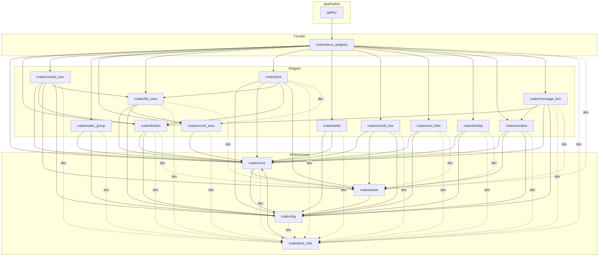

# Bevy Widgetry Architecture

本文件描述 bevy_widgetry 当前的整体 architecture、Workspace 组成以及内部依赖关系。

## Architecture Overview

bevy_widgetry 使用 Cargo Workspace 组织。

整体上由应用、顶层 facade、各功能 crate、共享基础设施和测试基础设施组成。

当前 Workspace 的主要结构为：

```text
gallery/
├── src/logging.rs
├── src/assets.rs
├── src/assets/
├── src/gallery.rs
├── src/renderer.rs
├── src/pages.rs
└── src/pages/

crates/
├── log/
├── asset/
├── bevy_widgetry/
├── core/
├── button/
├── combo_box/
├── radio_group/
├── scroll_area/
├── list_view/
├── tree/
├── table/
├── check_box/
├── text_field/
├── tooltip/
├── window/
├── message_box/
└── test_utils/
```

## Workspace Roles

本节仅简要介绍各成员的职责和用途，不展开 API、文件分工或具体实现细节。

### `crates/bevy_widgetry`

顶层 facade crate。

负责聚合并统一暴露 Widgetry 各功能 crate，本身不承载具体 Widget 实现。

### `crates/core`

共享基础设施 crate。

承载跨 Widget 共享能力和整个 Widgetry 使用的基础设施，包括 App 级默认字体 fallback；通过 asset 加载内建得意黑。

提供接收原始 Scene / BSN 的 deferred command 错误适配，通过 facade 的 scene module 导出；失败以 Severity::Error 交给宿主 handler，构造失败清理本次预约 root。同步 Scene 展开也由 core 适配，失败清理尚未写入 Component 的新预约 entity；原有 entity 与带 Component 的业务副作用保留。另提供内部异常边界 bookkeeping；诊断 state 由各行为所属 Component 持有，core 不提供全局诊断 system 或日志配置。

同时集中定义全库 overlay layer token，供普通 popup、Tooltip、modal blocker 与应用局部浮层共享。

通过 Workspace 内部的 WidgetryUiPlugin 与 WidgetryUiSystems 集中维护动态 UI 构造顺序，不由 facade 导出。Build 在 UI Prepare 前完成 model projection、renderer subtree 重建和 window lifecycle；Materialize 在 Prepare 完成后、UI Propagate 前生成已有 tree 的 asset 内容。两个阶段通过统一约束保证新内容参与当帧 visibility propagation、UI stack、hierarchy propagation、文本 measurement 和 layout，default font fallback 等待 Materialize 完成。使用这些阶段的 plugin 自动补齐共享调度 plugin，应用无需单独装配；Update / PreUpdate 中构造的内容也会参与后续 PostUpdate 消费阶段。PostUpdate 中自定义动态构造 system 必须遵守这份阶段契约，不保证在消费阶段之后创建的内容同帧可见。

### `crates/asset`

Widgetry 内建 asset 基础设施，集中存储静态文件、embedded 注册并提供语义 asset 标识。

依赖外部 bevy 和底层 log，不依赖 core；不解析 SVG，也不由顶层 facade 直接依赖或导出。

### `crates/log`

底层内部日志基础设施，提供固定 bevy_widgetry target 的 info/warn/error macro。
生产依赖仅依赖 Bevy，测试通过 dev-dependency 使用 test_utils。
不配置 subscriber 或输出，不保存 state，不由 facade 导出。

### `crates/test_utils`

共享测试基础设施。

供各 crate 的测试复用，不属于正常生产依赖路径。共享 headless Scene 环境可进一步装配官方 UI、文本、picking 与 visibility plugin，以验证动态内容的首帧渲染准备，不创建 native window 或 render device。

通过内部依赖 core 复用 theme type，提供统一的测试 theme 切换 helper function，并提供 thread-local 日志与 Bevy 宿主 error handler 捕获，以复用诊断及错误传播行为验证。

### `gallery`

Widgetry 的实际消费者和集成展示应用，用于人工体验、BRP 辅助的运行时集成验证，以及展示当前 Widget 能力。

Gallery 始终使用 `WinitSettings::desktop_app()`，并默认安装外部 `bevy_brp_runtime::BrpRuntimePlugin`，为 Codex CLI 提供截图、输入模拟、运行时状态检查和应用生命周期控制。该调试能力只属于 Gallery，不进入 Widgetry 库的生产依赖路径。

应用日志由 logging module 配置 Bevy LogPlugin，使用固定启动本机时区，同时输出终端和 `gallery/logs/` 下每次启动新建的文件；WorkerGuard 由 main 持有到运行结束。

ListView page 通过 facade 注册 Gallery 业务 item type，独立 model 支撑 Small、10k virtualized、root disabled 与 item disabled 四类示例；页面仅通过公开 row identity 和 hierarchy 计算 rendered count/range。

Tree page 通过 facade 按业务 Component 注册 Basic、Folder、File renderer，独立 ECS hierarchy 与 Tree model 支撑 Basic、异构、lazy loading 和 10k nodes 示例。Gallery 从 ChildrenRequested 发生时计算 lazy deadline，外部创建 children 并完成 lazy state；在途工作通过 RequestRedraw 推进，继续使用 desktop_app 运行模式。status 使用公开 model state、row identity 与 hierarchy 显示 selection 和 rendered range。

ComboBox page 通过 facade 注册业务 item type，独立 model 支撑 Text、Icon + Text、Icon 与动态 CRUD 示例；root disabled 示例共享文本 source。动态示例只通过公开 model API、ListView state 与 hierarchy 展示 stable selection、内容修改和 per-item disabled。TitleBar theme selector 使用独立 ThemeMode model，以 stable id 读取业务 theme 并静默初始化 selection。

应用自有 asset 由内部 assets module 的 GalleryAssetPlugin 管理，与库内 asset 保持独立。

### `crates/window`

自定义 Window Widget crate，提供 window UI、theme、native window 交互与 UI lifecycle 管理。

同时提供外部资源绑定、owned window 资源的 ownership 和 parent window 的 pointer modal overlay；不承载 WidgetryMessageBox 业务语义。

### `crates/combo_box`

通过 generic BSN SceneComponent 组合不可编辑的 ComboBox，直接消费独立 WidgetryListModel<T> source 与 WidgetryListViewRenderer<T>。

Field 复用 button Widget，箭头使用 core 的 WidgetryIcon 和 asset 内建 chevron；Popup wrapper 内组合 WidgetryListView<T>，不再自行维护 option rows。
通过 WidgetryComboBoxAppExt 自动注册对应 ListView 与 ComboBox typed runtime；公开 selection identity 为 model-local WidgetryListItemId，root 转发用户通知。

ComboBox 不创建独立 model、item id 或 renderer abstraction，不保留旧 options API 或 ValueChange<usize> compatibility 层。id 必须结合所属 source 解释；不同 model 可能分配相同数值，因此 set_selected 只检查 id 是否存在于当前 source，不提供跨 model provenance 检查。

内部 ListView 的 WidgetryListViewState.selected 是唯一 selection authority；初始化仅在非空且尚无 selection 时静默选择第一项。Field 从真实 state 与 model 派生内容，按 stable id、current index 与 revision cache 重建 renderer subtree；无 selection 时保留 Button 与 icon。通过 ListView 的 PostUpdate SyncState system set，Field projection 在 state repair 后加入 core 的 Build 阶段，由共享调度保证重建内容当帧可见且排在 Field background 之上。

Popup 按 model 长度与最大可见行数派生有界高度，内部 ListView 填满内容区、移除自身 border 并排除顺序 Tab navigation。Field 打开非空 Popup 时 focus 移交 ListView，列表滚动、virtualization、keyboard navigation 与 item disabled 直接复用 ListView；用户改值及有效重选关闭 Popup，Escape 关闭并返回 Field focus，outside click 不抢回 focus。关闭后只释放仍滞留在内部 ListView 的 focus，避免隐藏列表继续接受 keyboard selection。root disabled 镜像到 Button 与 ListView，model 清空或 root 新增 disabled 时关闭 Popup。不为调用方内容自动配置字体。

### `crates/check_box`

基于 Bevy 官方 Checkbox 提供 styled binary Checkbox，并提供 Widgetry 自己的 tri-state Checkbox；两者共享 indicator、theme style 与内建 SVG asset，并保持对应 Checkbox Accessibility 语义。

### `crates/message_box`

基于 window 与 button 组合固定尺寸的 non-blocking parent-window modal dialog，提供固定结果 button 组与异步 EntityEvent。
使用 core 共享 theme foreground color，结果 observer 执行后由独立关闭阶段销毁 owned root。

### `crates/radio_group`

通过 BSN SceneComponent 提供标准 RadioGroup 与 RadioOption，用户内容追加在内建圆形 indicator 后。

复用 Bevy RadioGroup、RadioButton 与 radio_self_update 处理用户选择，以固定 direct child index 对外通知；负责默认选择、静默程序化选择、root disabled 同步及 theme style。
生产依赖仅为 Bevy、core 与 log，不依赖其他 Widget 或 asset；测试通过 dev-dependency 使用 test_utils。

plugin 自动装配 Bevy 官方 TabNavigationPlugin；RadioGroup 的 focus 和 keyboard navigation 依赖应用提供的官方输入 plugin。

### `crates/scroll_area`

ScrollArea 通过 BSN SceneComponent 接收任意 Content Scene 与 children SceneList，组合官方 ScrollArea 和 Scrollbar、reserved Grid gutter、theme style、keyboard 输入与 WidgetryScrollIntoView。公开 Viewport 与 Content marker 提供组合 Widget 的 runtime 挂载入口；keyboard scroll 默认启用，构造时可以关闭而不影响 wheel 或程序化滚动。Viewport 上的原生 ScrollPosition 保存滚动 state；私有收敛 state 按真实 UI layout pass 求解 Auto scrollbar，并在尚未稳定时请求 redraw。

独立 crate 依赖 Bevy 与 core，测试通过 dev-dependency 使用 test_utils；顶层 facade 通过 scroll_area module 暴露完整公共 API。

### `crates/list_view`

ListView 使用 model-local stable item id、独立内容 revision 与持久 disabled metadata，提供 logical selection/active state、type-erased renderer 和按业务 item type 注册的 App extension。pointer、keyboard 与静默 programmatic selection 以 stable id 为 authority；缓存 index 在结构变化后校验并修复，当前 rows 的 Selected 与 root ActiveDescendant 仅做 physical projection。root 提供 ListBox accessibility 和唯一 Tab stop，不使用官方 ListBox marker；row 使用官方 ListItem。

BSN 在同 root 组合纵向 ScrollArea，隐藏 scrollbar、关闭 ScrollArea keyboard scroll，并建立 Viewport、Content 与上下 spacer。typed runtime 在 UI layout 前按固定行高实例化真实可见 rows，以 index overlap 复用 wrapper，并按 entry id/revision 更新 renderer direct children；spacer 使真实 ScrollArea layout 保持完整列表高度。root disabled 只投影用户输入限制与 row state，不改变 model metadata；通过 viewport 的官方 ScrollArea marker 关闭 wheel/trackpad 入口，仍保留原生 ScrollPosition、layout 与程序更新。plugin 自动补齐 ScrollArea、theme 与 foreground propagation。生产依赖为 Bevy、accesskit、core、scroll_area 与 log；ListView 在组合语义上建立在 ScrollArea 之上，测试通过 dev-dependency 使用 test_utils 与 asset 的语义字体接口。

### `crates/tree`

Tree 核心 model 以 ECS hierarchy 的 Entity 为 node identity；root 是不显示的容器，marker 仅标识 node，expanded 与 selected 由 model 的 UI state 管理。迭代式 DFS 生成 visible item 与 index cache，外部 hierarchy mutation 后修复失效 identity。

Tree plugin 在共享 Build 阶段、ListView state repair 前从 hierarchy 生成 projection，并通过 insert/remove/move/update 增量同步同 source 的 ListModel，保留未受影响 node 的 entry identity。lazy children 的 Unknown/Loading/Loaded 由 node 的独立 Component 表示，ChildrenRequested 交给应用加载；程序选择静默，隐藏 selection 保留，失效 node 清除。

WidgetryTreeView 通过 BSN 在 root 内组合 ListView；row 按 depth 缩进，expander 复用官方 Button 的交互与 WidgetryIcon。Entity selection 投影到 ListView state，root disabled 同帧镜像到 ListView 与 expander，不修改 model state。ListView 的公开 Reconcile 阶段支持组合 Widget 在 row 创建后完成内容构造。生产依赖为 Bevy、core、list_view、button、asset 与 log；测试通过 dev-dependency 使用 test_utils 与 scroll_area，facade 通过 tree module 导出。

Tree 的 App extension 按业务 Component 注册 type-erased SceneList renderer，每个 rendered node 必须恰好匹配一种注册类型，没有 priority matcher 或 fallback。业务 Component mutation、type 切换或同 type 重新注册会更新内容；Tree 在 ListView Reconcile 后、共享 Build 内展开 renderer subtree，使新内容参与当帧 UI 消费。持久业务 state 留在业务 node，不依赖 virtualized row lifecycle。

### `crates/table`

Table 的独立 ECS Model 包含 Row 与 Column 两个内部 Axis，各自使用 model-local stable identity。Column 持有异构 Header 与 typed schema projection，不承载 width、selection 或 layout；Cell 使用 RowId × ColumnId 查询当前 Row value 的 owned 异构值，不建立独立 Cell identity。Row mutable access 与 Column Header/schema replacement 分别推进各自 revision，move 保留 identity，remove/clear 后 ID 不复用。

Cell 与 Header 使用两个独立的 Bevy TypeRegistry Resource，通过 App extension 注册 typed SceneList factory。缺失 renderer 返回 Error，同类型重新注册替换 factory 并推进 generation；factory 只负责 Content，不接管 shell。

WidgetryTable<T> 通过 BSN source prop 接入固定外部 Model，四区 Grid 在 Body 使用官方两轴 ScrollArea，Column Header 与 Row Header 分别同步对应轴。Row Header 显示当前行号，Corner 为空。每个 View 独立的 layout Component 保存 fixed/flexible width，style Component 维护区域 shell 与 theme/disabled 外观，Content 按 Row/Column revision 和 registry generation 替换。typed runtime 在共享 Build 阶段构造直接 Cell entity projection，source 失效时清理自有内容并向宿主传播 Error；不销毁调用方 source。root持有独立的单一selection与logical FocusedCell，不依赖可见Cell实体；四方向navigation按当前Model顺序移动并reveal，pointer/keyboard受整体disabled限制，程序化selection静默。Column resize由root gesture管理，Header右侧handle只修改该View的width，并发出Start/Resized/End语义event。Body仅投影当前两轴相交Cell，Header保留完整Axis，三个canvas使用共同subpixel几何。生产依赖为 Bevy、core 与 log，测试通过 dev-dependency 使用 test_utils；facade 通过 table module 导出。

### `crates/text_field`

以 Bevy 官方 EditableText 为编辑基础，通过 WidgetryTextField 与 WidgetryReadOnlyTextField 两种 BSN SceneComponent 提供共享的单 entity layout 与 theme style。只读控件保留 focus、selection 与复制能力，在官方编辑阶段前过滤用户文本修改。

plugin 自动装配 theme 与 Bevy 官方 TabNavigationPlugin；TextField 自行接住 Bevy 的 AcquireFocus，以在不参与顺序 Tab navigation 时保留 pointer focus；并在官方编辑阶段前清理 disabled Widget 的全部用户操作。不安装字体 fallback 或官方文本输入 plugin，文本、换行及可见行数由调用方配置。

### `crates/tooltip`

通过 WidgetryTooltip BSN SceneComponent 提供 styled Tooltip，内容由可重复调用的任意 SceneList factory 构造。

crate 内部保存基于 HoverMap、ancestor lookup、固定 warmup/cooldown timing 的 headless state machine；popup 仅在显示期间作为 anchor direct child 存在，并使用 Bevy Popover 完成 window 边缘 placement。

## Dependency Graph

图中的箭头表示：

```text
A --> B
= A depends on B
```

实线表示正常生产依赖，虚线表示测试依赖。


```mermaid
flowchart TD
    subgraph Application
        gallery["gallery"]
    end

    subgraph Facade
        widgetry["crates/bevy_widgetry"]
    end

    subgraph Widgets
        button["crates/button"]
        combo_box["crates/combo_box"]
        radio_group["crates/radio_group"]
        scroll_area["crates/scroll_area"]
        list_view["crates/list_view"]
        tree["crates/tree"]
        table["crates/table"]
        check_box["crates/check_box"]
        text_field["crates/text_field"]
        tooltip["crates/tooltip"]
        window["crates/window"]
        message_box["crates/message_box"]
    end

    subgraph Infrastructure
        log["crates/log"]
        asset["crates/asset"]
        core["crates/core"]
        test_utils["crates/test_utils"]
    end

    gallery --> widgetry

    widgetry --> core
    widgetry --> button
    widgetry --> combo_box
    widgetry --> radio_group
    widgetry --> scroll_area
    widgetry --> list_view
    widgetry --> tree
    widgetry --> table
    widgetry --> check_box
    widgetry --> text_field
    widgetry --> tooltip
    widgetry --> window
    widgetry --> message_box

    message_box --> window
    message_box --> button
    message_box --> core
    message_box --> log

    button --> core
    combo_box --> core
    combo_box --> button
    combo_box --> asset
    combo_box --> list_view
    radio_group --> core
    radio_group --> log
    scroll_area --> core
    scroll_area -. dev .-> test_utils
    list_view --> core
    list_view --> scroll_area
    list_view --> log
    list_view -. dev .-> test_utils
    list_view -. dev .-> asset
    tree --> log
    tree --> core
    tree --> list_view
    tree --> button
    tree --> asset
    tree -. dev .-> test_utils
    tree -. dev .-> scroll_area
    table --> log
    table --> core
    table -. dev .-> test_utils
    check_box --> core
    check_box --> asset
    check_box --> log
    text_field --> core
    tooltip --> core
    tooltip --> log
    window --> core
    window --> asset
    core --> asset
    asset --> log
    core --> log
    button --> log
    combo_box --> log
    text_field --> log
    window --> log

    test_utils --> core

    widgetry -. dev .-> test_utils
    widgetry -. dev .-> asset
    log -. dev .-> test_utils
    core -. dev .-> test_utils
    button -. dev .-> test_utils
    button -. dev .-> asset
    combo_box -. dev .-> test_utils
    radio_group -. dev .-> test_utils
    check_box -. dev .-> test_utils
    text_field -. dev .-> test_utils
    text_field -. dev .-> asset
    tooltip -. dev .-> test_utils
    tooltip -. dev .-> asset
    window -. dev .-> test_utils
    message_box -. dev .-> test_utils
    message_box -. dev .-> asset
```
