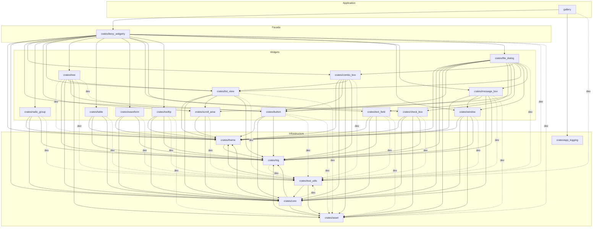

# Bevy Widgetry Architecture

本文件描述 bevy_widgetry 当前的整体 architecture、Workspace 组成以及内部依赖关系。

## Architecture Overview

bevy_widgetry 使用 Cargo Workspace 组织。

整体上由应用、顶层 facade、各功能 crate、共享基础设施和测试基础设施组成。

当前 Workspace 的主要结构为：

```text
gallery/
├── src/assets.rs
├── src/assets/
├── src/gallery.rs
├── src/pages.rs
└── src/pages/

crates/
├── log/
├── app_logging/
├── asset/
├── theme/
├── bevy_widgetry/
├── core/
├── button/
├── combo_box/
├── radio_group/
├── scroll_area/
├── list_view/
├── tree/
├── table/
├── waveform/
├── check_box/
├── text_field/
├── tooltip/
├── window/
├── message_box/
├── file_dialog/
└── test_utils/
```

## Workspace Roles

本节只列出成员的 architecture 角色。具体功能查看各成员 lib.rs / main.rs 的文件头部注释，内部依赖关系见下节。

| 成员 | 角色 |
| --- | --- |
| [gallery](../gallery/src/main.rs) | 展示与运行时验证应用。 |
| [crates/bevy_widgetry](../crates/bevy_widgetry/src/lib.rs) | 聚合公共 API 的顶层 facade。 |
| [crates/theme](../crates/theme/src/lib.rs) | 固定 Light/Dark 配色、各 Widget 与组合部件的完整 Colors 数据，以及主题选择与提交后通知。 |
| [crates/core](../crates/core/src/lib.rs) | 跨 Widget 共享基础设施，包括所有有效 Pointer 的官方 hover state 投影、跨 Widget 的 Pressed ownership 清理与独立 Widget 的幂等装配。 |
| [crates/asset](../crates/asset/src/lib.rs) | 内建 asset 管理。 |
| [crates/log](../crates/log/src/lib.rs) | 内部日志基础设施。 |
| [crates/app_logging](../crates/app_logging/src/lib.rs) | 宿主可选的应用日志配置，提供 terminal/file layer 与日志文件准备，不安装 subscriber 或提供 Plugin。 |
| [crates/test_utils](../crates/test_utils/src/lib.rs) | 共享测试与 benchmark 基础设施。 |
| [crates/window](../crates/window/src/lib.rs) | 自定义窗口界面与 lifecycle、native window 配置及透明多窗口 rendering 支持。 |
| [crates/file_dialog](../crates/file_dialog/src/lib.rs) | FileDialog 的 headless 业务 state、后台 filesystem、streaming snapshot、selection/validation、storage 与 BSN 内容。私有虚拟列表组合 ScrollArea，filter/sort 组合 typed ComboBox，默认嵌入内容，通过明确 window Props 组合 owned Window 与 Modal/NonModal，覆盖确认复用 MessageBox。 |
| 其余 Widget crate | 实现对应 Widget。 |

## Dependency Graph

图中的箭头表示：

```text
A --> B
= A depends on B
```

实线表示正常生产依赖，虚线表示测试依赖。


```mermaid
flowchart TD
    subgraph Application
        gallery["gallery"]
    end

    subgraph Facade
        widgetry["crates/bevy_widgetry"]
    end

    subgraph Widgets
        button["crates/button"]
        combo_box["crates/combo_box"]
        radio_group["crates/radio_group"]
        scroll_area["crates/scroll_area"]
        list_view["crates/list_view"]
        tree["crates/tree"]
        table["crates/table"]
        waveform["crates/waveform"]
        check_box["crates/check_box"]
        text_field["crates/text_field"]
        tooltip["crates/tooltip"]
        window["crates/window"]
        message_box["crates/message_box"]
        file_dialog["crates/file_dialog"]
    end

    subgraph Infrastructure
        log["crates/log"]
        app_logging["crates/app_logging"]
        asset["crates/asset"]
        theme["crates/theme"]
        core["crates/core"]
        test_utils["crates/test_utils"]
    end

    gallery --> widgetry
    gallery --> app_logging
    gallery -. dev .-> test_utils

    theme --> log
    widgetry --> theme
    core --> theme
    test_utils --> theme
    button --> theme
    check_box --> theme
    radio_group --> theme
    text_field --> theme
    combo_box --> theme
    scroll_area --> theme
    list_view --> theme
    table --> theme
    tooltip --> theme
    window --> theme
    message_box --> theme
    file_dialog --> theme
    waveform --> theme
    tree -. dev .-> theme

    widgetry --> core
    widgetry --> button
    widgetry --> combo_box
    widgetry --> radio_group
    widgetry --> scroll_area
    widgetry --> list_view
    widgetry --> tree
    widgetry --> table
    widgetry --> waveform
    waveform --> core
    waveform --> log
    waveform -. dev .-> test_utils
    widgetry --> check_box
    widgetry --> text_field
    widgetry --> tooltip
    widgetry --> window
    widgetry --> message_box
    widgetry --> file_dialog

    message_box --> window
    message_box --> button
    message_box --> core
    message_box --> log
    file_dialog --> core
    file_dialog --> log
    file_dialog --> asset
    file_dialog --> button
    file_dialog --> text_field
    file_dialog --> scroll_area
    file_dialog --> check_box
    file_dialog --> combo_box
    file_dialog --> list_view
    file_dialog --> window
    file_dialog --> message_box
    file_dialog -. dev .-> test_utils

    button --> core
    combo_box --> core
    combo_box --> button
    combo_box --> asset
    combo_box --> list_view
    radio_group --> core
    radio_group --> log
    scroll_area --> core
    scroll_area -. dev .-> test_utils
    list_view --> core
    list_view --> scroll_area
    list_view --> log
    list_view -. dev .-> test_utils
    list_view -. dev .-> asset
    tree --> log
    tree --> core
    tree --> list_view
    tree --> button
    tree --> asset
    tree -. dev .-> test_utils
    tree -. dev .-> scroll_area
    table --> log
    table --> core
    table -. dev .-> test_utils
    check_box --> core
    check_box --> asset
    check_box --> log
    text_field --> core
    tooltip --> core
    tooltip --> log
    window --> core
    window --> asset
    core --> asset
    asset --> log
    core --> log
    button --> log
    combo_box --> log
    text_field --> log
    window --> log

    test_utils --> core
    test_utils --> asset

    widgetry -. dev .-> test_utils
    widgetry -. dev .-> asset
    log -. dev .-> test_utils
    core -. dev .-> test_utils
    button -. dev .-> test_utils
    button -. dev .-> asset
    combo_box -. dev .-> test_utils
    radio_group -. dev .-> test_utils
    check_box -. dev .-> test_utils
    text_field -. dev .-> test_utils
    text_field -. dev .-> asset
    tooltip -. dev .-> test_utils
    tooltip -. dev .-> asset
    window -. dev .-> test_utils
    message_box -. dev .-> test_utils
    message_box -. dev .-> asset
```
