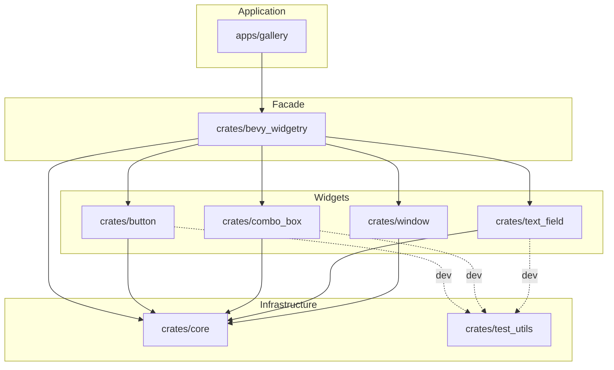

# Stage 9 目标 2：项目文档体系

## 目标

建立一套轻量、长期可维护、适合 Codex 获取项目上下文的文档体系。

这一体系不追求建立传统意义上的完整开发手册，也不重复源码、rustdoc 或工程规则中已经能够表达的信息。

核心原则是：

> 不同类型的项目知识拥有明确且唯一的主要归属。

---

## 一、文档体系划分

项目中的长期信息分为四类：

```text
requirements/
→ 项目规划、Stage 方案、讨论结果和历史设计背景

docs/
→ 项目当前实际架构

rules/
→ 开发过程中必须遵守的工程约束

源码 / rustdoc
→ crate、module、公共 API 及具体行为的当前语义
```

不额外建立公共 API 手册、控件说明书、设计百科等重复文档。

如果源码和 rustdoc 已经能够清楚表达某项内容，就不再在 `docs/` 中维护第二份说明。

---

## 二、`requirements/`

当前 `docs/` 中保存的规划和 Stage 文档迁移至：

```text
requirements/
```

例如：

```text
requirements/
├── bevy019自定义控件库规划.md
├── bevy_widgetry_第二阶段规划.md
├── Stage0/
├── Stage1/
├── Stage2/
├── ...
└── Stage9/
```

### 定位

`requirements/` 保存：

* 项目阶段规划；
* Stage 讨论结果；
* 当时确定的实现方案；
* 当时的设计判断与取舍；
* 理解某项功能为什么这样形成所需要的历史背景。

Stage 文档记录的是：

```text
当时讨论出了什么方案
为什么这样决定
```

它们**不代表项目当前代码状态**。

### Stage 文档维护原则

某个 Stage 完成后，其文档原则上作为历史记录保留。

后续架构或实现发生变化时，不为了同步当前状态而回头修改旧 Stage 文档。

只有原文档本身存在错误时，才需要修正。

---

## 三、`docs/`

第一版 `docs/` 只保留：

```text
docs/
└── architecture.md
```

目前不预先建立其他文档。

未来如果出现真正无法由 `architecture.md`、源码、rustdoc、rules 或 Stage 文档合理承载的长期知识，再根据实际需要新增。

---

## 四、`docs/architecture.md`

### 定位

`docs/architecture.md` 是项目**当前架构事实**的说明。

它的主要用途是让人工开发者和 Codex 在深入读取源码之前，可以快速建立整个 Workspace 的架构心智模型。

它不承担：

* 工程规则；
* 公共 API 使用说明；
* 控件内部实现说明；
* 具体状态机说明；
* Stage 设计历史；
* module / struct / Plugin 索引。

规则由 `rules/` 负责，API 与具体语义由 rustdoc 和源码负责。

### 内容

````markdown
# Bevy Widgetry Architecture

本文件描述 `bevy_widgetry` 当前的整体架构、Workspace 组成以及内部依赖关系。

## Architecture Overview

`bevy_widgetry` 使用 Cargo Workspace 组织。

整体上由应用、顶层 facade、各功能 crate、共享基础设施和测试基础设施组成。

当前 Workspace 的主要结构为：

```text
apps/
└── gallery/

crates/
├── bevy_widgetry/
├── core/
├── button/
├── combo_box/
├── text_field/
├── window/
└── test_utils/
````

## Workspace Roles

### `crates/bevy_widgetry`

顶层 facade crate。

负责聚合并统一暴露 Widgetry 各功能 crate，本身不承载具体控件实现。

### `crates/core`

共享基础设施 crate。

承载跨控件共享能力和整个 Widgetry 使用的基础设施。

### `crates/test_utils`

共享测试基础设施。

供各 crate 的测试复用，不属于正常生产依赖路径。

### `apps/gallery`

Widgetry 的实际消费者和集成展示应用。

用于人工体验、集成验证和展示当前控件能力。

## Dependency Graph

图中的箭头表示：

```text
A --> B
= A depends on B
```

实线表示正常生产依赖，虚线表示测试依赖。



````

### 依赖图原则

依赖图：

- 只描述 Workspace 内部依赖；
- 不展示 Bevy、rstest 等外部依赖；
- 节点使用仓库目录名；
- 不深入到 module、类型或 system 层级；
- 实线表示生产依赖；
- 只有具有架构意义的测试依赖才使用虚线展示。

目录树同样只展示 Workspace 成员层级，不继续深入 `src/`、`tests/` 等内部目录。

---

## 五、`rules/architecture.md`

`rules/architecture.md` 与 `docs/architecture.md` 可以保留相同文件名，因为路径已经表达两者不同的性质：

```text
rules/architecture.md
→ 架构必须遵守什么

docs/architecture.md
→ 当前架构实际上是什么
````

判断一项内容属于哪里时使用：

> 如果违反这句话应该被 Code Review 拒绝，它属于 `rules/`；
> 如果这句话只是帮助理解项目当前架构，它属于 `docs/`。

`rules/architecture.md` 调整为纯粹的架构约束文件：

````markdown
# 架构规则

本文件只定义项目在架构层面必须遵守的约束。

当前 workspace 结构、crate 组成、依赖关系和架构角色等描述性信息，应记录在 `docs/architecture.md` 中，不在这里重复维护。

## Crate 依赖约束

### 顶层 facade

下层 crate 禁止反向依赖顶层 `bevy_widgetry` facade crate。

顶层 facade 不应承载具体控件的行为实现。具体控件实现应位于对应控件 crate 中。

### `core`

`core` 只允许承载：

- 明确具有跨控件共享价值的基础能力；
- 本质上属于整个库的基础设施。

不得仅因为某段代码“以后可能复用”就提前放入 `core`。

控件专属的类型、状态、样式和行为应继续留在对应控件 crate 中。

`core` 不得依赖上层控件 crate。

### 控件 crate

一个控件自己的以下内容，默认归属于该控件 crate：

- headless 行为；
- Style；
- Plugin；
- 控件专属 Component、Resource、Event、Message 和其他类型；
- 控件内部实现；
- 对应测试。

控件 crate 默认不得仅为了实现方便而依赖兄弟控件 crate。

当一个控件在语义或组合关系上明确建立在另一个控件之上时，可以形成必要的单向依赖。

禁止 crate 之间形成循环依赖。

### `test_utils`

`test_utils` 只用于共享测试基础设施。

生产代码不得依赖 `test_utils`。

需要使用 `test_utils` 的 crate，应通过测试相关依赖使用，不得将其引入正常生产依赖路径。

### `apps/*`

`apps/*` 属于库的消费者。

库 crate 不得依赖 `apps/*`。

应用层代码不得为了实现方便下沉到库中，除非该能力本身已经明确成为库需要提供的通用能力。

## Crate 内部组织

Library crate 使用 `lib.rs` 作为入口。

Application crate 使用 `main.rs` 作为入口。

`lib.rs` 主要用于：

- module 声明；
- re-export；
- 必要的 crate 级装配。

不应在 `lib.rs` 中堆放大量具体实现。

模块应按职责和语义划分。

不得仅因为：

- 文件较长；
- 希望目录更整齐；
- 希望不同 crate 结构看起来一致；

就主动拆分或重组 module。

不得机械采用“一种类型一个文件”的组织方式。

## Module 布局

除集成测试目录外，源码统一使用现代 Rust module 布局，不使用 `mod.rs`。

推荐形式：

```text
src/
├── lib.rs
├── headless.rs
├── headless/
│   ├── state.rs
│   └── behavior.rs
├── style.rs
└── style/
    ├── layout.rs
    └── visual.rs
````

该结构只是常见组织方式，不要求所有 crate 强行采用相同目录形态。

`tests/` 下的集成测试可以根据实际需要使用 `mod.rs` 组织测试模块。

## 可见性

所有声明默认使用满足当前需求的最小可见性。

```text
仅当前 module 使用
→ private

仅 crate 内共享
→ pub(crate)

明确属于对外 API
→ pub
```

不得仅为了：

* 实现方便；
* 跨 module 调用方便；
* 测试方便；

而扩大可见性。

普通开发任务不得顺手扩大公共 API 面。

哪些内容属于正式公共 API，应由专门的公共 API 设计工作决定。

````

---

## 六、`AGENTS.md`

`docs/architecture.md` 需要成为 Codex 获取项目上下文的正式入口。

第一版先让所有代码修改任务默认读取该文件。

如果后续实践发现这种方式明显增加上下文消耗，或 Codex 在大量简单任务中读取该文件没有实际收益，可以再缩小触发范围。

同时，任何任务如果修改了 `docs/architecture.md` 所描述的架构事实，都必须在同一任务中同步更新该文档。

`AGENTS.md` 调整为：

```markdown
# Bevy Widgetry Codex Guide

本文件是 Codex 进入项目时的统一入口。

不要在这里重复详细工程规范或项目架构说明；根据任务内容读取对应的规则和文档。

## 默认要求

任何代码修改任务都必须先读取：

- `docs/architecture.md`
- `rules/task-scope.md`
- `rules/code.md`

其中：

- `docs/architecture.md` 用于了解项目当前的 Workspace 结构、架构角色和内部依赖关系；
- `rules/` 下的文件用于约束开发行为。

根据任务内容继续读取：

- 涉及 crate 依赖约束、module 组织、可见性等架构规则：`rules/architecture.md`
- 涉及依赖、新增 crate、Cargo 配置或 crate/package 命名：`rules/dependencies.md`
- 涉及注释、rustdoc、测试注释：`rules/documentation.md`
- 涉及新增行为、行为修改、bug 修复或测试：`rules/testing.md`

一个任务可以同时命中多个规则文件；必须读取所有相关规则。

## 架构文档同步

`docs/architecture.md` 描述项目当前实际架构。

如果当前任务修改了其中记录的架构事实，必须在同一任务中同步更新该文件。

典型情况包括：

- Workspace member 增加、删除或移动；
- crate 或 app 的架构角色发生变化；
- Workspace 内部生产依赖关系发生变化；
- `docs/architecture.md` 中明确记录的测试依赖关系发生变化。

普通源码修改、外部依赖版本变化或其他不影响该文档所描述架构事实的改动，不需要更新 `docs/architecture.md`。

## 规则优先级

`rules/` 中的规则是项目工程硬约束。

若任务目标与规则发生真实冲突，不得自行放宽规则；应明确指出冲突并把它作为设计问题处理。
````

---

## 七、最终目录关系

完成本目标后，项目中的相关目录概念上形成：

```text
AGENTS.md
│
├─ 默认引导 Codex 阅读 docs/architecture.md
└─ 根据任务路由到 rules/

requirements/
├─ 项目规划
└─ Stage 历史方案与讨论结果

docs/
└─ architecture.md
   └─ 当前项目架构事实

rules/
├─ architecture.md
└─ ...
   └─ 开发硬约束

crates/ + apps/
└─ 源码 / rustdoc
   └─ 当前实现和 API 语义
```

整个体系保持轻量，不为了“文档完整性”建立源码已经能够替代的重复说明。

---

## 八、目标 2 完成标准

完成以下工作后，Stage 9 目标 2 可以视为完成：

1. 将当前规划和 Stage 文档从 `docs/` 迁移到 `requirements/`；
2. 创建新的 `docs/architecture.md`；
3. 根据新的职责边界整理 `rules/architecture.md`；
4. 更新 `AGENTS.md`，让 Codex 默认读取架构文档；
5. 在 `AGENTS.md` 中建立架构变化与 `docs/architecture.md` 的同步要求；
6. 确认 `requirements/`、`docs/`、`rules/`、rustdoc 之间不存在明显的职责重叠。

目标完成后，不额外创建 API 手册、crate 说明书或其他预设文档。
